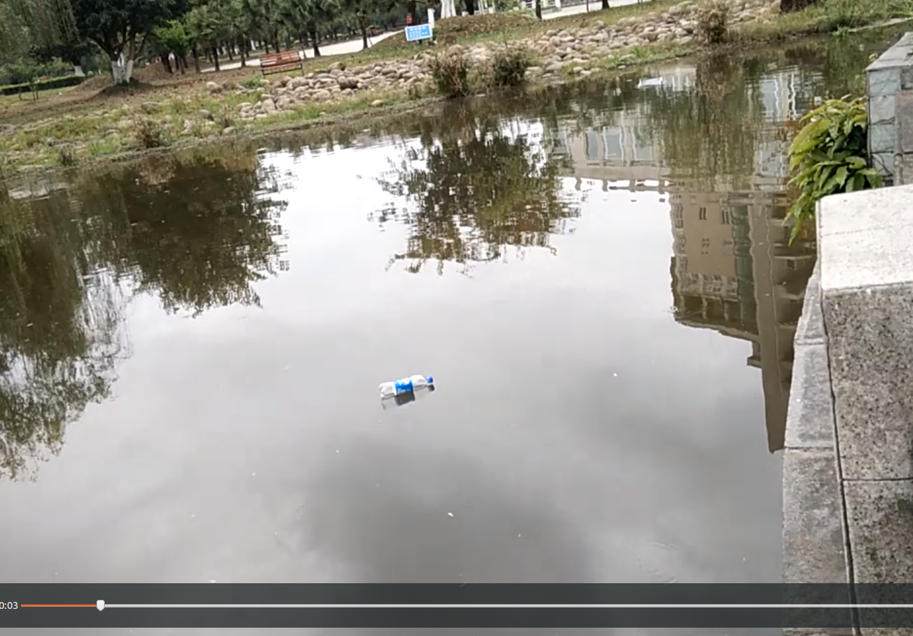

## 1、图像处理


再图片中添加二次方程曲线

通过构建y=ax^2+b方程，对在方程上的点赋值为[0, 255, 255]

原图



结果图


```python

# coding:utf-8
import cv2

from math import sqrt
image=cv2.imread('/home/cooper/图片/a1111.png')
print(image.shape)

h,w=image.shape[0],image.shape[1]


# RIGHT TOP TO LEFT BO
# for i in range(h):
#     tp=-i/(h/w)+w
#     image[i,int(tp)-1,:]=[0,255,255]

    #     -i/(h/w)+w==tp


# (w-tp-w//2)^2=i
# tp=-sqrt(i)+w//2
a=300
for i in range(h):
    tp = int((-sqrt(a*i) + w // 2))
    np = int((sqrt(a*i) + w // 2))
    if tp>w or tp<1:
        continue
    if np>w or np <1:
        continue
    image[i, tp:tp+2, :] = [0, 255, 255]
    image[i, np:np+2, :] = [0, 255, 255]
# cv2.imshow('image',image)
cv2.imwrite('1.jpg',image)
cv2.waitKey(0)

```


