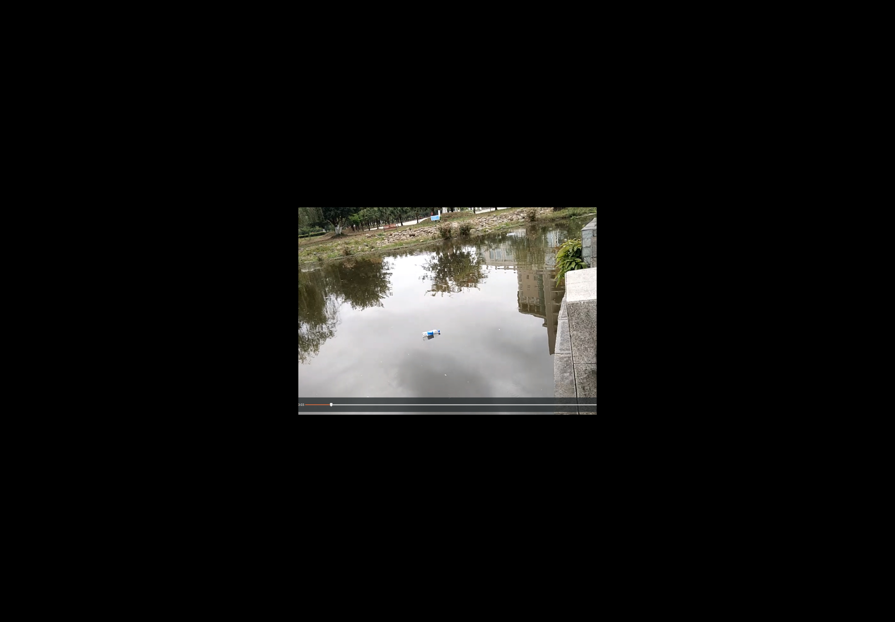

## 2、图像处理实验2


#### 1、图像放大缩小，缩小比例系数为3

原图：

read image code:
```python
# coding:utf-8
import cv2
import numpy as np
from math import sqrt
image=cv2.imread('/home/cooper/图片/a1111.png')
print(image.shape)
h,w=image.shape[0],image.shape[1]
```


#### 缩小后的图

code:
```python
downscale=3

image=np.array(image,np.int32)
downimage=np.zeros((h//downscale,w//downscale,3),np.int32)
for i in range(downimage.shape[0]):
    for j in range(downimage.shape[1]):
        downimage[i,j,:]=(image[downscale*i,downscale*j,:]+image[downscale*i+1,downscale*j,:]+image[downscale*i,downscale*j+1,:]+image[downscale*i+1,downscale*j+1,:])//4

downimage=np.array(downimage,np.uint8)
cv2.imwrite('2downimage.jpg',downimage)
cv2.imwrite('2image.jpg',np.array(image,np.uint8))
cv2.waitKey(0)
```


#### 2、放大图

code:
```python

upscale=3
upimage=np.zeros((h*upscale,w*upscale,3),np.int32)

for i in range(upimage.shape[0]):
    for j in range(upimage.shape[1]):
        upimage[i,j,:]=image[i//3,j//3,:]
cv2.imwrite('2upimage1.jpg',np.array(upimage,np.uint8))
cv2.imshow('image',np.array(image,np.uint8))

cv2.waitKey(0)


```


#### 3、添加全黑边框

code:
```python
upscale=3
upimage=np.zeros((h*upscale,w*upscale,3),np.int32)
upimage[image.shape[0]:image.shape[0]*2,image.shape[1]:image.shape[1]*2,:]=image
cv2.imwrite('2upimage.jpg',np.array(upimage,np.uint8))
cv2.imshow('image',np.array(image,np.uint8))

cv2.waitKey(0)
```



#### 4、裁剪部分图片

code:
```python
cv2.imshow('image',np.array(image,np.uint8))
cv2.imwrite('2cut.jpg',np.array(image[100:500,200:500,:]))
cv2.waitKey(0)
```


#### 4、拼接图片

code:
```python
image=np.concatenate([image,image],axis=1)
cv2.imwrite('2concatimage.jpg',np.array(image,np.uint8))
cv2.waitKey(0)
```


