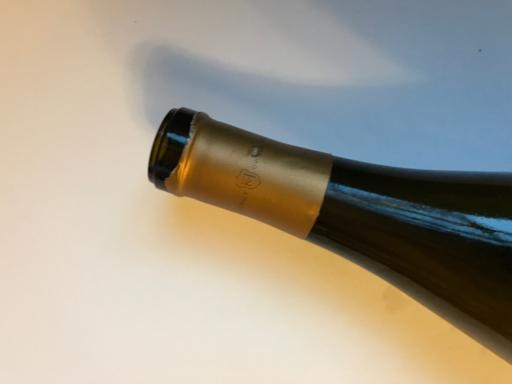
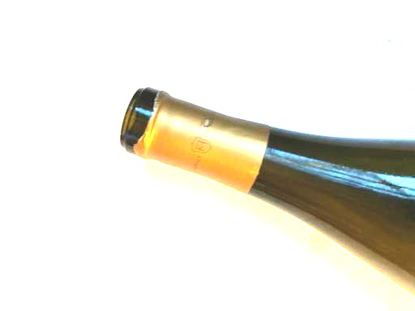
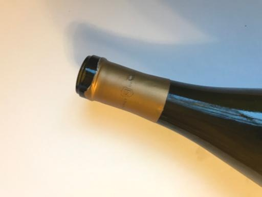

## 图像处理实验3 

### 1、读取图片
```python
#coding:utf-8
import cv2
import numpy as np

path='/home/cooper/Dataset/dataset-resized/dataset-resized/glass/glass45.jpg'


image=cv2.imread(path)
image=np.array(image,np.int32)
grayimage=np.sum(image,axis=2)/3
grayimage=np.array(grayimage,np.uint8)
image=np.array(image,np.uint8)
cv2.imwrite('3image.jpg',image)
cv2.imwrite('3grayimage.jpg',grayimage)
```

### 2、原图



对比度增强

code
```python
for k in range(3):
    for i in range(h):
        for j in range(w):
            if image[i][j][k]<k:
                image[i][j][k]=max(0,image[i][j][k]//2)
            else:
                image[i][j][k]=min(255,image[i][j][k]*2)
```


### 3、亮度增强

code:
```python
k=180

h,w=image.shape[0],image.shape[1]

for k in range(3):
    for i in range(h):
        for j in range(w):
            image[i][j][k] = min(255, image[i][j][k]+20)
cv2.imwrite('3liangdu.jpg',image)
```



